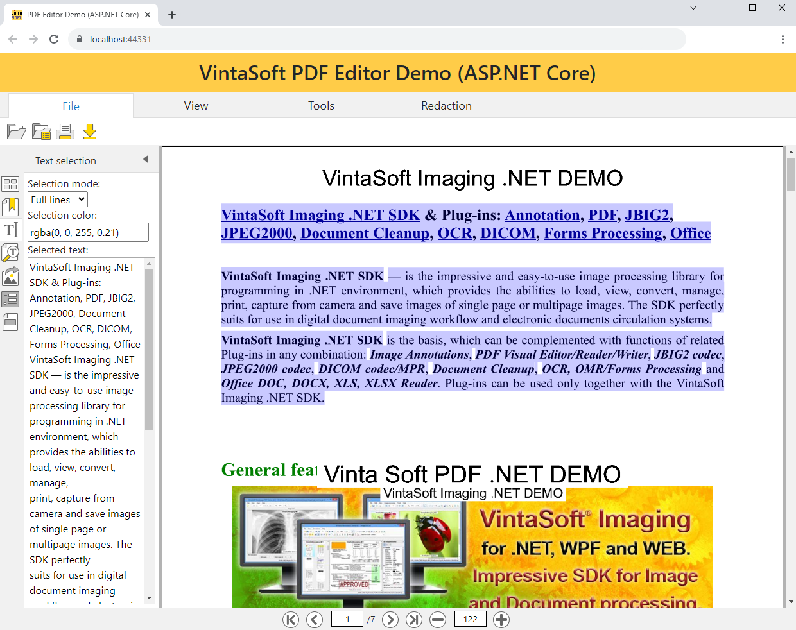
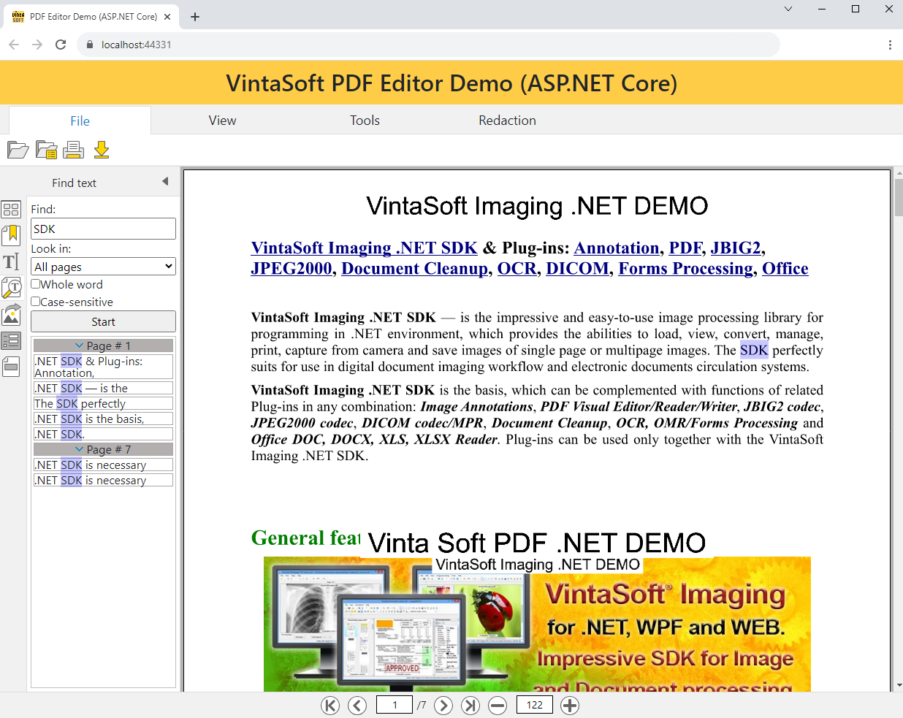
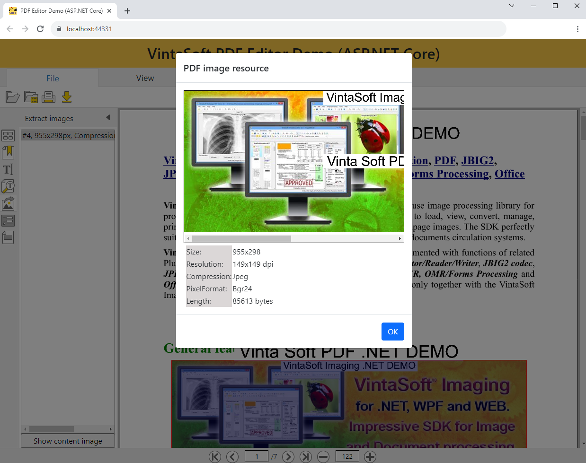
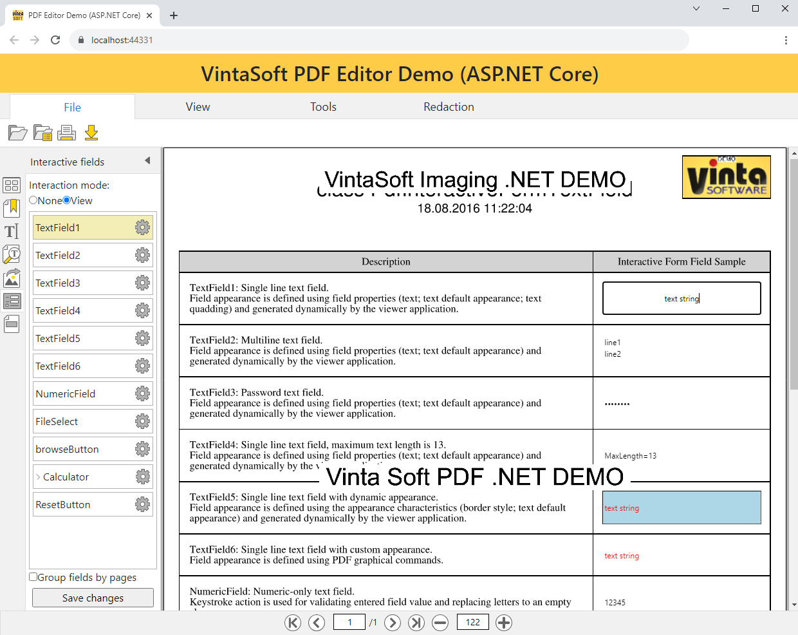
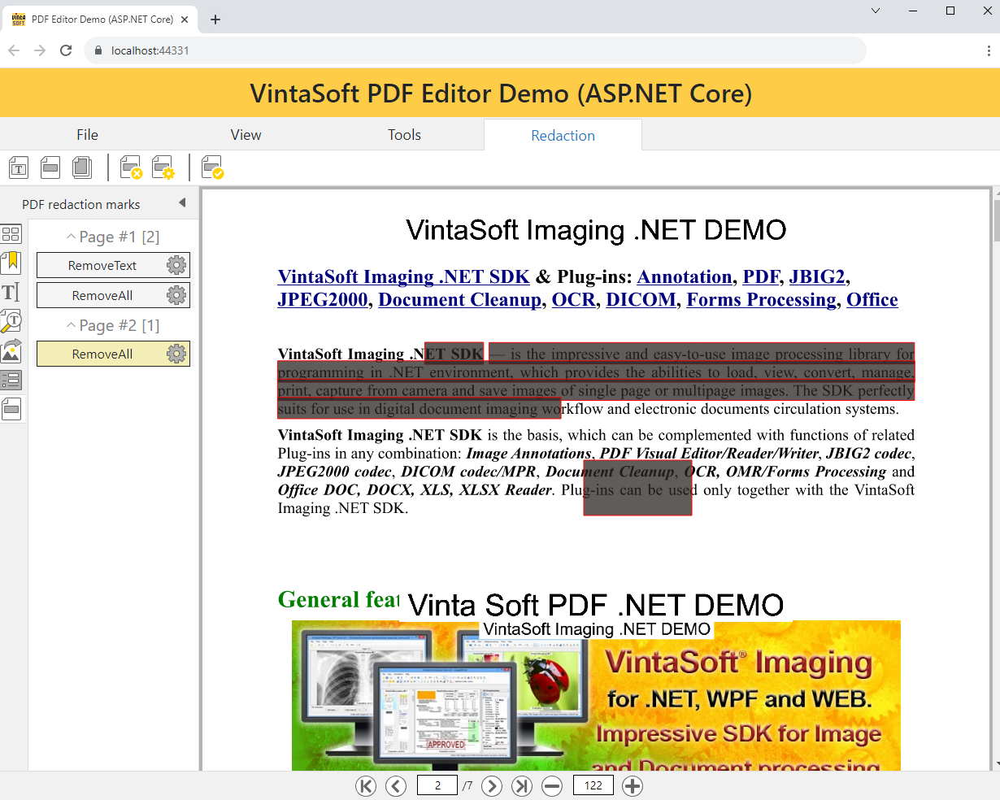
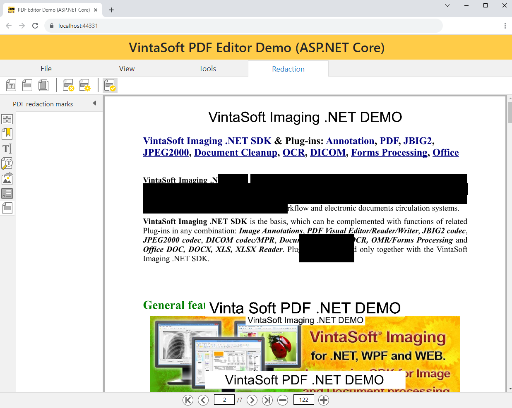

# VintaSoft ASP.NET Core PDF Editor Demo

This ASP.NET Core project uses <a href="https://www.vintasoft.com/vsimaging-dotnet-index.html">VintaSoft Imaging .NET SDK</a>.
The client-side of project uses HTML+JavaScript+CSS. The server-side of project uses ASP.NET Core API controllers.<br />
<br />
The project demonstrates how to view, fill and redact PDF document in ASP.NET Core:
* Open PDF document.
* View thumbnails of pages.
* View vectorized pages. Each PDF page is rendered as SVG object only once. This provides smoth zooming of page in viewer.
* Select text on pages.
* Search text on pages.
* Extract image-resources on page.
* Fill form on pages.
* Redact content on pages.
* Download filled and redacted PDF document.
* The application can be used in any modern HTML5 web browser.
* The application UI is localized into 45 languages (Afrikaans, Arabic, Armenian, Azerbaijan, Belarusian, Bulgarian, Chinese, Croatian, Czech, Danish, Dutch, English, Estonian, Finnish, French, Georgian, German, Greece, Hebrew, Hindi, Hungarian, Italian, Japanese, Kazakh, Korean, Kyrgyz, Latvian, Lithuanian, Norwegian, Portugese, Romanian, Russian, Slovakian, Slovenian, Spanish, Swahili, Swedish, Tajik, Tatar, Turkish, Turkmen, Ukrainian, Uzbek, Vietnamese, Zulu).


## Screenshot
<br />







## Usage
1. Get the 30 day free evaluation license for <a href="https://www.vintasoft.com/vsimaging-dotnet-index.html" target="_blank">VintaSoft Imaging .NET SDK</a> as described here: <a href="https://www.vintasoft.com/docs/vsimaging-dotnet/Licensing-Evaluation.html" target="_blank">https://www.vintasoft.com/docs/vsimaging-dotnet/Licensing-Evaluation.html</a>

2. Update the evaluation license in "src\Startup.cs" file:
   ```
   Vintasoft.Imaging.ImagingGlobalSettings.Register("REG_USER", "REG_EMAIL", "EXPIRATION_DATE", "REG_CODE");
   ```

3. Build the project ("AspNetCorePdfEditorDemo.Net10.csproj" file) in Visual Studio or using .NET CLI:
   ```
   dotnet build AspNetCorePdfEditorDemo.Net10.csproj
   ```

4. Run compiled application and try to view and annotate images and documents.


## Documentation
VintaSoft Imaging .NET SDK on-line User Guide and API Reference for Web developer is available here: https://www.vintasoft.com/docs/vsimaging-dotnet-web/


## Support
Please visit our <a href="https://myaccount.vintasoft.com/">online support center</a> if you have any question or problem.
